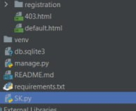
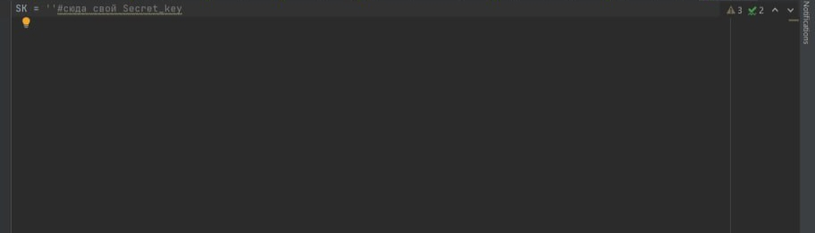

1. Устанавливаем необходимые для работы проекта зависимости

    > ___pip install -r requirements.txt___

2. В файле __SK__ вводим свой DJANGO-Secret-Key 

3. переходим по ссылке:

   > http://127.0.0.1:8000/board/posts/
   
